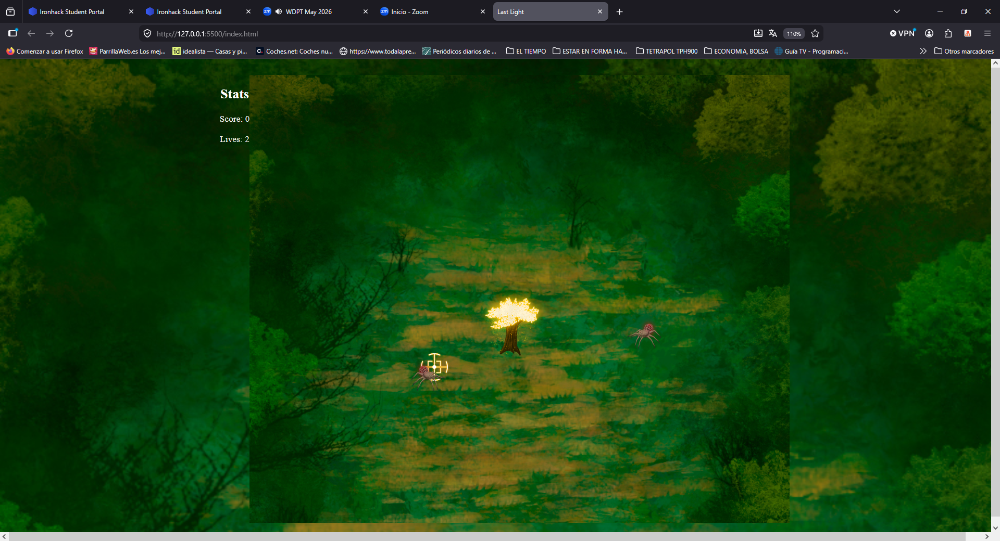

# MiniGame-Project
Creating a mini game using Js, Css and Html.

Play as a magic tree trying to survive the infinite waves of enemies that comes after you. To survive you must use your arrow keys to move the crosshair and then shoot with the space bar. Be aware that if you shoot and there is no enemy on the crosshair it wont shoot. You have 3 lives, each time an enemy touches you, you loose 1 live. Each kill will increase the score in 1 and each time you kill 5 enemies you heal 1 live.

In this game the AI was used to help me find the errors or bugs that appeared on the console or for getting unstuck.
Examples: 
"What this error on the console means?"
"How can I do a square root in Javascript?"
"Why when I shoot, the bullet wont show on screen?"
"Why my lives arent increasing when I kill an enemy?"
"How can I make my crosshair gets bigger when it shoots?"

All the art assets on this project where done by me.

The sound effects are from: https://uppbeat.io

The song is from: https://soundcloud.com/leagueoflegends/sets/sessions-diana